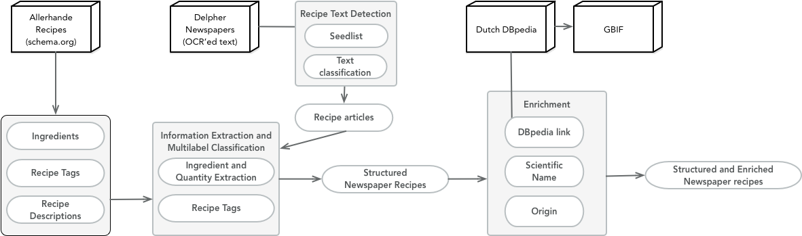

# Historical Recipe Web
__Repo for our paper '[Constructing a Recipe Web from Historical Newspapers](https://github.com/DHLab-nl/historical-recipe-web/blob/master/constructing-recipe-web-2.pdf)'__

Authors: Marieke van Erp, Melvin Wevers, Hugo Huurdeman
  

## Summary
This repository contains the [code](https://github.com/DHLab-nl/historical-recipe-web/tree/master/code), [data](https://github.com/DHLab-nl/historical-recipe-web/tree/master/data), [figures](https://github.com/DHLab-nl/historical-recipe-web/tree/master/figures) and [trained models](https://github.com/DHLab-nl/historical-recipe-web/tree/master/models) related to the paper 'Constructing a Recipe Web from Historical Newspapers'. This paper is [accepted for the International Semantic Web Conference (ISWC) 2018](http://iswc2018.semanticweb.org/accepted-papers/). The assets in this repository are licensed under the [Apache License 2.0](https://github.com/DHLab-nl/historical-recipe-web/blob/master/LICENCE.md). Due to copyright restrictions, the text from the newspaper articles is not included, but can be retrieved via the document IDs.

## Paper Abstract 
Historical newspapers provide a lens on customs and habits of the past. For example, recipes published in newspapers highlight what and how we ate and thought about food. The challenge here is that newspaper data is often unstructured and highly varied, digitised historical newspapers add an additional challenge, namely that of fluctuations in OCR quality. Therefore, it is difficult to locate and extract recipes from them. We present our approach based on distant supervision and automatically extracted lexicons to identify recipes in digitised historical newspapers, to generate recipe tags, and to extract ingredient information. We provide OCR quality indicators and their impact on the extraction process. We enrich the recipes with links to information on the ingredients. Our research shows how combining natural language processing, machine learning, and semantic web can be used to construct a rich dataset from heterogeneous newspapers for the historical analysis of food culture.

### Keywords
natural language processing, information extraction, food history, digitised newspapers, digital humanities

## TO DO:
* Add additional figures used in paper
* Improve quantity extraction
* Add additional documentation
